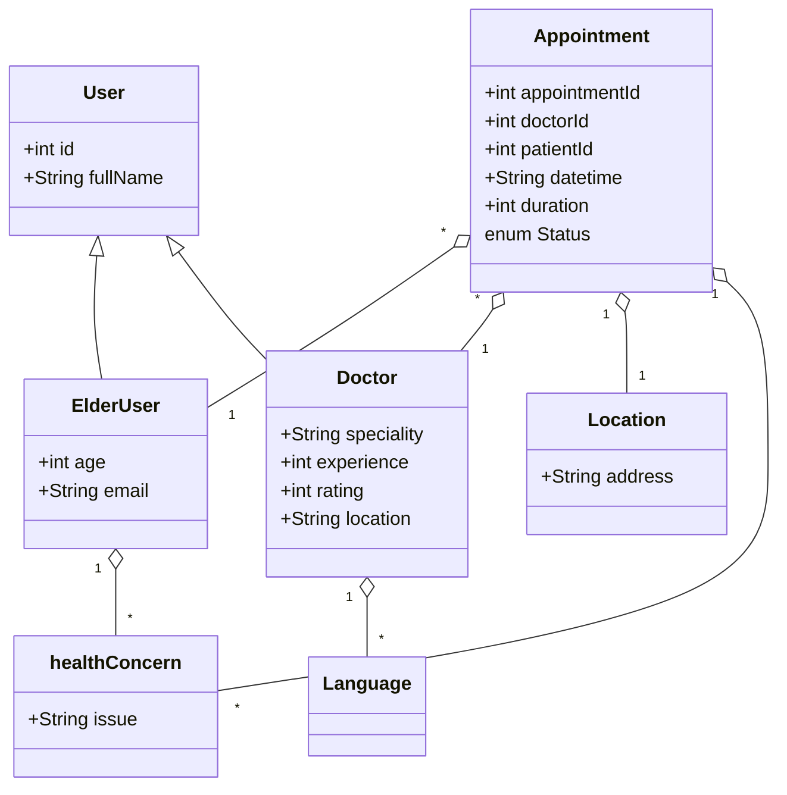

#Object Model

```mermaid

---

Object Model for elder user registration

---

classDiagram
    class ElderUser {

        +int age
        +String email

    }

    class Doctor{

        +String speciality
        +int experience
        +int rating
        +String location
    }
    class ElderUser
    class Doctor
    class User{
        +int id
        +String fullName

    }

    class Appointment{

      +int appointmentId
      +int doctorId
      +int patientId
      +String datetime
      +int duration
      enum Status
}


    class Location{
        +String address

    }


    class healthConcern{
        +String issue
    }
    class Language{

    }
    User <|-- ElderUser
    User <|-- Doctor
    Appointment "*" o-- "1" ElderUser
    Appointment "*" o-- "1" Doctor
    Appointment "1" o--"1" Location
    Appointment "1" o--"*" healthConcern
    Doctor "1" o--"*" Language
    ElderUser "1" o--"*" healthConcern

```
